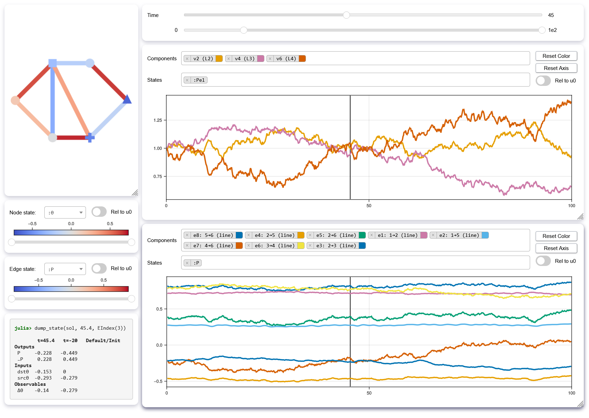

# NetworkDynamicsInspector.jl

`NetworkDynamicsInspector.jl` is an extension package to
[NetworkDynamics.jl](https://github.com/JuliaDynamics/NetworkDynamics.jl)
which provides a WebApp based on [`Bonito.jl`](https://github.com/SimonDanisch/Bonito.jl)
and [`WGLMakie.jl`](https://github.com/MakieOrg/Makie.jl) for interactive visualization 
of solutions to systems based on network dynamics.

Its main entrypoint is the `inspect` function, which takes a solution from a `Network` problem.
For more information visit [documentation of the main package](https://juliadynamics.github.io/NetworkDynamics.jl/dev/).

``` julia
using NetworkDynamics, NetworkDynamicsInspector

nw = Network(...)
prob = ODEProblem(nw, ...)
sol = solve(prob, ...)

inspect(sol)
```


